# Compte rendu SAE3D04

<link rel="stylesheet" type="text/css" href="style.css">

</br></br>

## Mettre en place une infrastructure virtualisée

</br></br>

> Ce projet vise à comparer différents systèmes de virtualisation pour remplacer l'environnement VMWare actuellement en place. L'expertise a été réalisée dans un contexte professionnel et a impliqué l'installation et la configuration de serveurs Windows et Proxmox. Les progrès de l'installation ont été documentés pour créer une documentation utile et explicative de nos actions. Le compte rendu général reprend les comptes rendus de chaque partie.

</br></br>

## Table des matières

</br>

1. Gestion de projet
2. Proxmox
3. Hyper-V et Windows Server
4. VPN
5. Comparatif et conclusion

</br></br></br>

Avec la participation de Julien Alleaume, Ilker Onay, Mathieu Puig et Ndeye Codou Touré

## Gestion de projet

### Le projet

Le projet est basé sur une situation professionnelle, qui consiste en une expertise ayant pour but de comparer différents systèmes de virtualisation afin de remplacer l'environnement VMWare.

#### Nos objectifs

Pour réaliser ce projet, notre objectif est de comparer VMware, Hyper-V (la solution de virtualisation de Windows) et Proxmox (une solution de virtualisation open source gratuite).

Pour ce faire, nous avons décidé d'installer ces deux solutions directement sur des serveurs physiques. Nous nous fixons donc comme objectif d'installer deux serveurs Hyper-V et trois serveurs Proxmox afin de faire fonctionner CEPH.

Pour résumer :

* 2 serveurs Windows qui communiquent entre eux pour réaliser des migrations à chaud
* 3 serveurs Proxmox avec un système de partage de fichiers CEPH pour effectuer les migrations à chaud.

#### Notre organisation

Nous avons d'abord noté dans un référentiel git le sujet qui est accessible à tous afin que tous les membres du groupe comprennent bien nos objectifs.


Après cela, pour simplifier la gestion des tâches et avoir une organisation claire du travail à exécuter, nous avons pris l'initiative de réaliser un projet "SAE Cloud" sur Jira Work Management afin de visualiser les tâches de chacun et de suivre l'avancement du projet.


En plus pour une meilleure gestion des serveurs, nous avons mis en place des crédits en ligne accessibles par tous et modifiables selon nos configurations.


Parmi les informations utiles incluses dans ces crédits, nous avons :


#### Taches realiser au cours du projet

Lors de ce projet, nous avons réalisé plusieurs tâches réparties sur deux semaines. Elles sont résumées dans le schéma suivant :


Pour résumer, nous avons pu réaliser toutes les installations que nous voulions faire sur Proxmox. Nous avons également pu installer un VPN qui nous a permis d'administrer nos serveurs à distance. Du côté de Windows, nous avons pu découvrir l'environnement Windows Server et Hyper-V, et nous somme allez jusqu'a la migration a chaud.

#### Conclusion et ameloiration possible

On peut donc dire que malgré l'ampleur de notre projet, grâce au travail fourni par les membres du groupe, nous avons atteint nos objectifs principaux.

Ce projet nous a montré que la coordination du travail est très importante, car nous avons pu voir qu'un manque de coordination pouvait mener à des désaccords au sein d'un groupe de travail. En vue d'améliorer notre travail en groupe à l'avenir, nous pourrions mettre en place des méthodes de gestion de projet plus efficaces pour éviter ces désaccords et atteindre nos objectifs de manière plus efficace.

</br></br></br></br></br></br></br></br></br></br></br></br></br></br></br>

## Proxmox

> Vous pouvez retrouvez des commandes à la fin du documents

### 1.Installation

#### A quoi sa sert ?

Ici nous allons définir les différents termes qu'on va utiliser par la suite et leur fonctionnement.

CEPH : C'est une solution libre de stockage distribué qu'on peut retrouver sur proxmox.

Monitor:Les moniteurs (Mons) Chaque cluster Ceph nécessite la mise en œuvre de moniteurs installés sur des serveurs indépendants. Ces moniteurs sont utilisés par les clients Ceph pour obtenir la carte la plus à jour du cluster. Les moniteurs s’appuient sur une version modifiée du protocole Paxos pour établir entre eux un consensus sur la cartographie du cluster

Manager:

OSD: À chaque OSD correspond un démon chargé de stocker les données, de les répliquer ou de les redistribuer en cas de défaillance d’un équipement. Chaque démon OSD fournit aussi des informations de monitoring et de santé aux moniteurs Ceph. Un cluster Ceph doit à minima disposer de deux démons OSD (3 sont recommandés) pour démarrer.

Pool: Un cluster Ceph stocke les données sous forme d’objets stockés dans des partitions logiques baptisées “pools”. À chaque pool Ceph correspond un ensemble de propriétés définissant les règles de réplications ou le nombre de groupes de placement dans le pool.Par exemple, si l’on a spécifié trois copies et que le cluster dispose de trois nœuds, la triple réplication permet de survivre à deux pannes de nœuds ou à la panne de deux disques.

</br></br></br></br></br></br></br>

#### Prérequis

Pour l'installation CEPH il vous au minimum 2 partitions de disques virtuels par serveur. Nous sommes sur des serveurs qui ont déjà était utiliser donc dans notre cas il faut `supprimer` les partitions de disques virtuals et par la suite on obtient une seul partitions qu'on `clear`. Car lors de la créations des OSD Ceph il faut allouer une partitions de disques si on déjà étaient allouer a d'ancien noeud il se peut que proxmox vous bloquer à cette étape et vous devez tout recommencer, c'est pour celà qu'il vaut mieux s'en assurer dès le débuts.

C'est aussi une occasion d'activer `NPar+ SR-IOV`, SR-IOV crée 8 carte réseaux virtuelle et NPar permet de gérer la bande passante sur celle-ci (exemple : Si on a juste une carte réseaux occupée toute la bande passante lui appartient mes si ont a deux cartes réseaux 'occuper' la bande passante est diviser en 2 , etc,etc,...)

L'activation de NPAR+ SR-IOV :
Chemin : `Device Settings -> Votre carte 10G -> Device Level Configuration -> Virtualization Mode : NPar+ SR-IOV`


> On peut observer qu'ils ont bien était activées.


Suppression des cartes réseaux :
Chemin : `Device Settings -> Intgrated RAID Controller
-> Virtual Disk Management`


#### 1.1 Promox

##### 1.1.1 BIOS

Dans un premier temps il faut booter son iso sur le IDRAAC, pour ceci il faut cliquer sur `Connecter le média virtuel`, ajouter l'iso Proxmox puis le Mapper


> Vous pouvez cliquer sur `fermer`

Choisir de le booter sur `Virtual CD / DVD / ISO`


`Réinitialiser le système (démarrage à chaud)`


##### 1.1.2 Proxmox

Appuyer `Entrer`


Cliquer sur `I agree`


Il faut choisir la partition de disque, puis cliquer sur `Next` ( sinon on peut cliquer sur `options` pour modifier )


Selectioner votre Pays/Zone, puis cliquer sur `Next`


Mot de passe : rftgy#123 (dans notre cas), saissir une email valide


> IP address : Adresse que récupéra votre serveur Proxmox

Gateway : Dans mon cas c'est la passerelle par défauts de la salle

DNS : Dans mon cas celui de l'IUT


Cliquer `Install`


</br></br></br>

##### Connection via console

Exemple :

```bash
Login : root
Mot de passe : rftgy#123
```


###### Connection graphique


#### 1.2 CEPH

##### 1.2.1.Cluster

Pour l'installation de Ceph il faut crée un cluster avec minimum 3 noeud est recommandée.

Donc pour celà, sur la machine "hôte" il faut crée un cluster puis partager son code au autres noeuds.

Pour ce faire aller dans `Cluster` puis dans `Create a cluster` est il s'affichera la page ci-dessous.


Une fois dedans Entrée un nom de cluster par exemple `CephIlker` car ce Cluster va me servir pour faire du CEPH

Quand on clique sur le Cluster on a maintenant accès au boutton `Cluster Join Information` celui-ci va permettre a vos autres noeuds de facilement rejoindre le cluster (la meilleur façon de copier et de cliquer sur `Copy Information` pour être sur de ne pas oublier le moindre caractères à copier)


Après celà, il nous reste plus qu'à aller dans la partie cluster sur les autres noeuds et cliquer sur `Join Cluster` pour rejoindre le cluster a fin de faire les liens entre eux. Dans la catégorie Information il faut copier le "code", puis dans password entrer le mot de passe du serveur qui détient le cluster dans notre cas tout le mot de passe proxmox est `rftgy#123`. Il nous reste plus cas choisir le cluster network qu'il vous propose.


##### 1.2.2.Ceph

##### Etape 1

Après avoir crée est rejoint notre cluster avec les deux autres serveurs il faut installer notre CEPH.

Pour celà il faut cliquer sur CEPH dans la catégorie de notre noeud numéro un, deux et trois. Puis cliquer sur install ( Attention en aucun cas ne fermer pas la page car votre installation risque de crash et vous devez tout recommencer). Une fois avoir cliquer sur l'install il se fera automatiquement seulement dans le premier noeud vous aurez a choisir votre `Public Network` qui est l'IP de votre serveur numéro un, pour les autres l'installation ce fait automatiquement.


##### Etape 2

Sur votre noeud dans la catégorie `CEPH` puis `Monitor` ajouter les moniteur et manager deux et trois en cliquant sur `Create` dans la partie Monitor ou Manager


##### Etape 3

Sur chaque noeud il va falloir crée une OSD, donc depuis la catégorie `CEPH` puis `OSD` cliquer sur crée est sélectionnées votre partition de disque libre


Une fois fini :


##### Etape 4

Il faut maintenant crée une pool depuis le pve1, pour faire celà aller dans `CEPH` puis `Pools`, cliquer sur `Create`


##### Etape 5

Pour voir le bon fonctionnement de toutes votre installation il faut vérifier l'état de santé de notre CEPH.
Pour cela il suffit de cliquer sur `CEPH` :


</br></br></br>

### 2.Utilisation

#### 2.1 Création d'une VM

La création de VM est un peu particulier sur proxmox l'installation via ISO, ça nécessitent de retirer la carte réseaux et de le r'ajouter après l'installation mais aussi de retirer le CD/DVD après l'installation pour pouvoir migrer la VM.

Pour crée votre VM il faut d'abord upload votre iso, rendez-vous dans votre noeud et cliquer sur `Image ISO` et cliquer sur `UPLOAD`,puis `Select File` pour selectionner votre ficher, finir en cliquant sur `UPLOAD`


Pour crée une VM, maintenant vous devez cliquer sur `Create VM` en haut à droite :

Il vous faut choisir le noeud d'appartenance, une ID est donner par défauts changer la si vous le souhaitez, donner un nom à votre VM.


Choissisez l'image ISO que vous souhaitez que votre VM doit prendre.


Je laisse par défauts


Définisser si vous voulez utiliser le stockage local ou ceph depuis `Storage` et la taille de Disk dans mon cas 8Go est largement suffisants

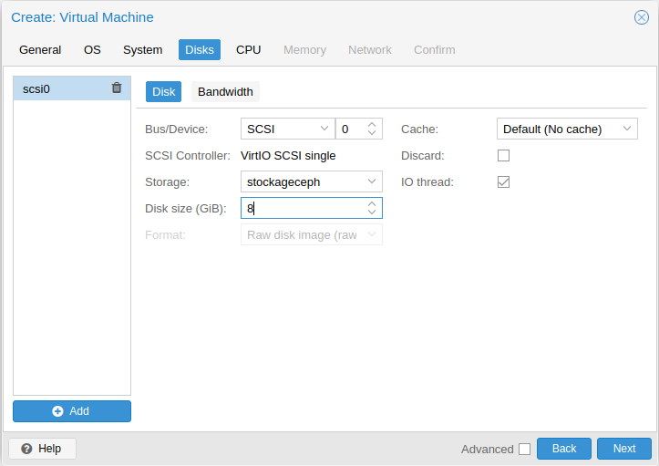

Quelque chose d'important sur proxmox est que pour chaque VM vous pouvez limiter la bande passante seulement sur la VM sans passer par une limitation au niveau du port comme VMWare


On peut augmenter le nombre de coeurs allouer


On peut augmenter la RAM (mémoire vice) allouer (Valeur en Mo)

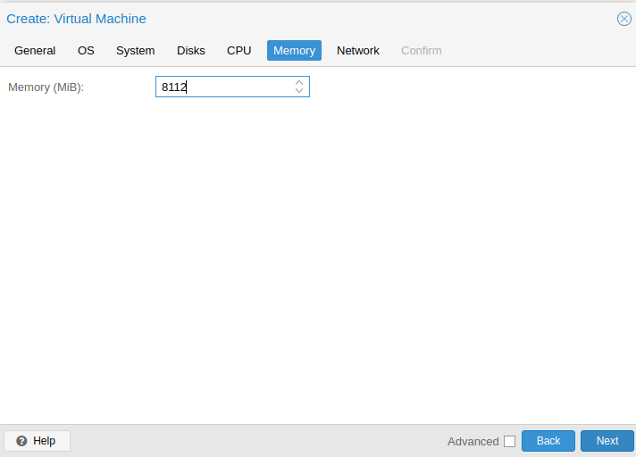

Ici on doit crée une vm sans carte réseaux pour l'ajouter après l'installation ISO fini, car dans l'établissement les installations de paquets et autres nous prend beaucoup de temps à cause de la connection internet. Donc pour éviter les installations de paquets ou autres il vaut mieux désactiver la création de carte réseaux (je vous montre par la suite comment la crée). Cliquer sur ``No network device`.


Vous pouvez relire les informations de création de votre VM pour vous assurer de votre configuration souhaitez.

Si vous souhaitez le démarrage après la création cliquer sur `Start after created` (en bas à gauche)


On peut observer qu'on a bien notre vm de crée mais il n'a pas de connection internet


Cliquer sur votre VM,ensuite dans le menu déroulant cliquer sur `Hardware`, puis sur `Add` et selectionner `Network Device`. Selectionner votre bridge et appuyer sur `Add`


On vérifie bien en ping 8.8.8.8, on a bien à une connection internet.


#### 2.2 Migration d'une VM

Pour migrer une VM après l'installation via ISO il necéssitent de se rendre dans la partie `Hardware` de votre VM et de modifier le `CD/DVD Drive` est de le mettre en mode `Do not use any media`


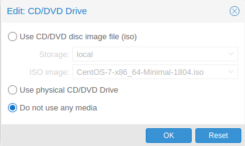

 Migration à froid :

Ici nous avons notre VM nommée "CentosMini" dans le noeud "pve1".


On clique droit dessus puis sur `Migrate` et on choissie vers quel noeud on voeud le migrer (mauvais screen j'ai migrer vers le noeud 3 on pourra le voir dans le screen suivants)

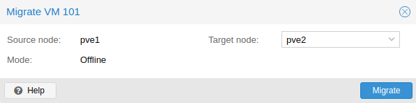

On peut observer le message (to node 'pve3', donc vers le noeud 3), la migration à réussis

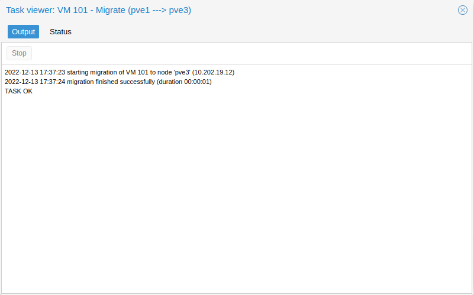


 Migration à chaud :

Maintenant, on va démarrer la VM pour faire une migration à chaud

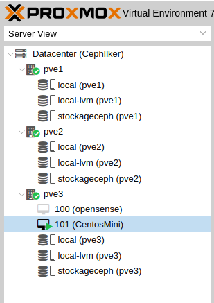

On migre au noeud de départ donc la une (pve1)


On peut voir que la migration à encore réussis


</br>

#### 2.3 Création d'une template

A partir d'une VM nous pouvons crée une template en fessant clique droit `Convert to template`

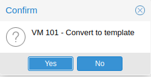

Pour déployer une VM depuis une template il faut faire clique droit dessus est choissir `Clone`, donner un nom a votre nouvelle VM et le mode de clonage par exemple Full Clone

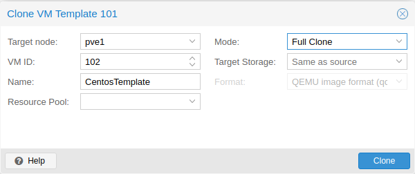

Le tour est jouer vous avez crée votre VM

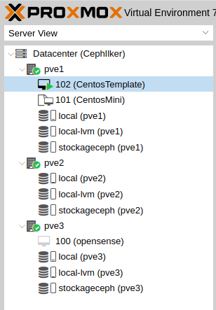

#### 2.4 Commande qui mon était utiles

Cette partie regroupe les commande que j'ai du utiliser lors de cette SAE pour proxmox

Pour supprimer un cluster :

```bash
#A taper sur le noeud d'appartence du cluster
systemctl stop pve-cluster
systemctl stop corosync
pmxcfs -l
rm /etc/pve/corosync.conf
rm /etc/corosync/* -rf
killall pmxcfs
rm /var/lib/corosync/* -f

systemctl start pve-cluster
```

Pour supprimer un noeud :

```bash
rm -r /etc/pve/[node_name]
```

Pour modifier l'IP du serveur proxmox :

```bash
vi /etc/network/interfaces
systemctl restart networking.service
```

</br></br></br></br></br></br></br></br></br></br></br></br>

</br></br></br></br></br></br></br>

</br></br></br></br></br></br>

## Hyper-V et Windows Server

### Initialisation du serveur

Pour commencer l'installation on a crée 4 disque virtuelle depuis le bios du serveur (3 disques de 500G vide et un dernier de 250G pour installer Windows Server) et activer la fonction SRIOV sur la carte réseau.

Installation de windows via la iDRAC en utilisant un ISO du site azure education et la clé fournis avec. On a utilisé la version windows server Datacenter 2022. La différence entre la version datacenter et la versions standard de windows server est (Je ne cite que les difference lié à hyper-v):

|    Standard      |   Datacenter    |
| :--------------- |:--------------- |
| deux machines virtuelles plus un hôte Hyper-V par licence  |   nombre illimité de machines virtuelles, plus un hôte Hyper-V par licence      |
| Pas de rôle serveur  | Dispose des rôle serveur             |
| Oui (conteneurs Windows en nombre illimité ; jusqu’à deux conteneurs Hyper-V)  | Oui (conteneurs Windows et Hyper-V en nombre illimité)         |
|Pas de support hyper-v Host-Guardian | Supporte le hyper-v Host-Guardian |

### Configuration de Windows

Après installation je crée le compte administrateur et me connecte (Ont a utilisé le même NOM et MDP pour les deux serveurs pour facilité la chose, mais on aurai pu crée un autre utilisateur sur les deux serveurs pour plus de securité)
J'arrive sur le bureau ou l'application `Gestionnaire de Serveur` s'affiche automatiquement à chaque démarrage.


Cette application permet de gérer les rôles du serveur et de le supervisé. Pour pouvoir me connecter à distance sans passer par l'iDRAC et avoir une meilleur experience visuel, j'active le paramètre `Bureau à distance`


Je fixe une adresse IP aux serveurs. Sous windows c'est dans Panneau de configuration -> Centre de réseau et partage -> Modifier les paramètres de la carte puis clique droit sur la carte et aller dans propriété. Sur Protocoles Internet versions 4 changer les propriétés et mettre la configuration de sont réseau.(IP, DNS, passerelle, etc...)

Pour suivre, je m'y connecte grâce à `Remmina` sur linux, ou bureau distant sur windows.

### Installations et réglages des rôles et fonctionnalités

Maintenant j'installe les rôles obligatoire au fonctionnement des serveurs Hyper-v pour pouvoir faire une migration à chaud(La chose la plus complexe à faire, car elle demande beaucoup de fonctionnalité supplémentaire à installer/configurer).

Pour ajouter des rôles il faut aller sur `Gérer` en haut à droite du `Gestionnaire de serveur`.


Cliquer sur suivant dans l'onglets `avant de commencer`


Selectionner la première options, qui permet d'installer de nouveau rôles et fonctionnalité.


Selectionner le serveur sur lequel vous voulez ajouter des rôles.


Le rôle hyper-v permet de crée un serveur qui gère la virtualisation et permet d'interconnecter plusieurs serveur hyper-v.


Dans les fonctionnalité on selectionne 'clustering de basculement` qui permet de crée des clusters de serveur Windows.


On arrive ensuite dans la configuration d'hyper-v.


Configuration d'hyper-v, je selectionne la carte réseau sur laquelle hyper-v vas crée sont commutateurs virtuel.

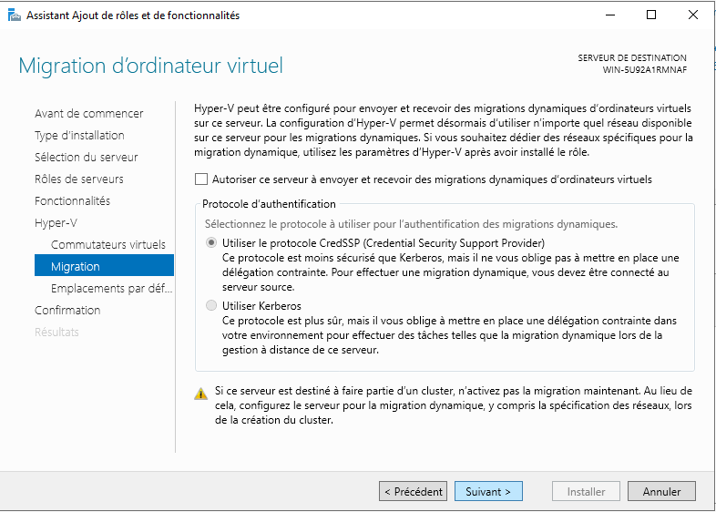

On peut activer et choisir le type de'authentification lors d'une migration. Etant donné que ce serveur vas être clusterisé on active aucune option ici.

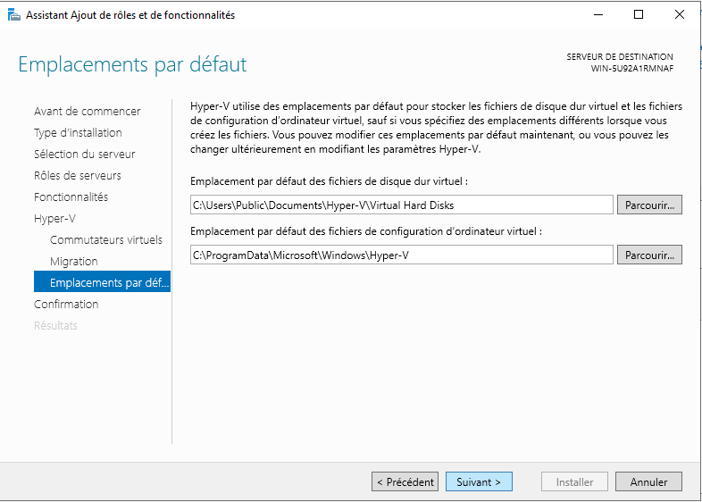

On peut selectionner l'emplacement de stockage des disques durs virtuels et des fichiers de configuration des ordinateurs virtuels.

Après ça j'installe `Windows Admin Center` qui permet d'acceder par web au informations du serveur et de l'administrer.


Suivre les intruction et je conseille de désactiver les mises à jours microsoft update pour l'installation d'admin center afin d'éviter tout problème on pourra les effectuer après sans soucis.

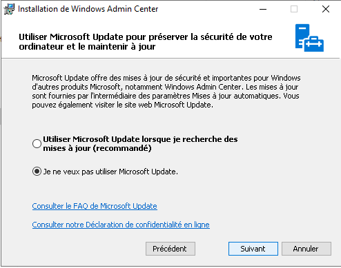

Activer WinRM sur https uniquement afin d'éviter des failles de sécurité et bug de droits plus tard.


Je décide de garder le port générique et de redirigé le trafic HTTP vers HTTPS pour éviter des conflits d'authentifications lors de la migration des VMs.


Pour ce connecter au site il faut utilisé de base le nom de l'ordinateur (ex : `https://WIN-XXXXXXXX`) et s'identifier avec un utilisateur de la machine local.
Une fois connecter voila l'interface que l'ont obtient :

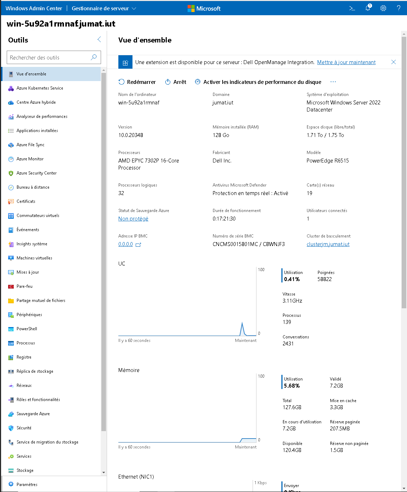

### Mise en place de la migration dynamique

Pour pouvoir faire la migration dynamique il faut crée un domaine et y mettre les deux serveurs.

Il faut ajouter le rôle service AD DS (active directory domain service). J'ai crée un domaine de manière rapide et sans pousser dans les détails.

Activation du rôle.

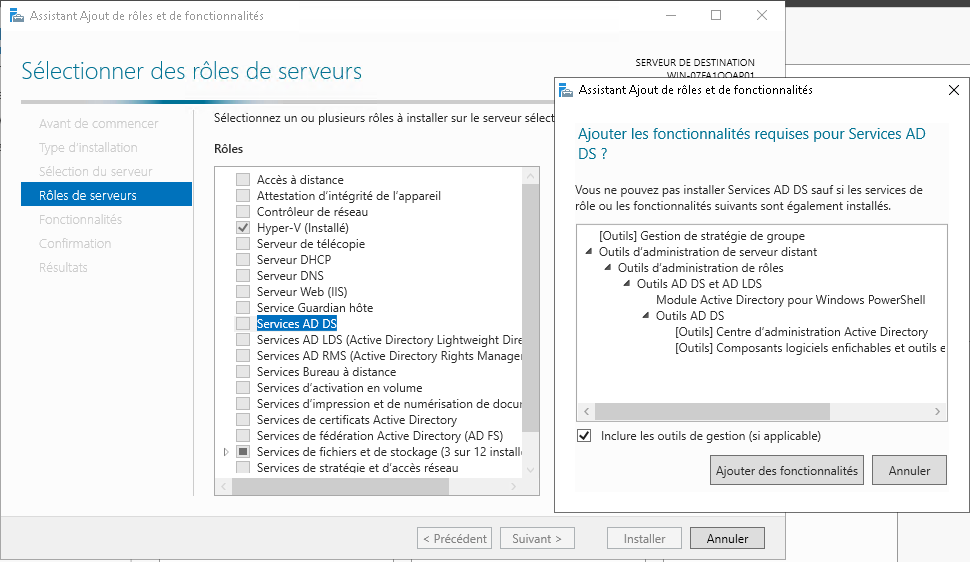

Poursuite de l'installation.


Création du nom de domaine, cocher la case `Ajouter une foret`, pour crée un nouveau domaine. Lui choisir un nom de type `nom.local`

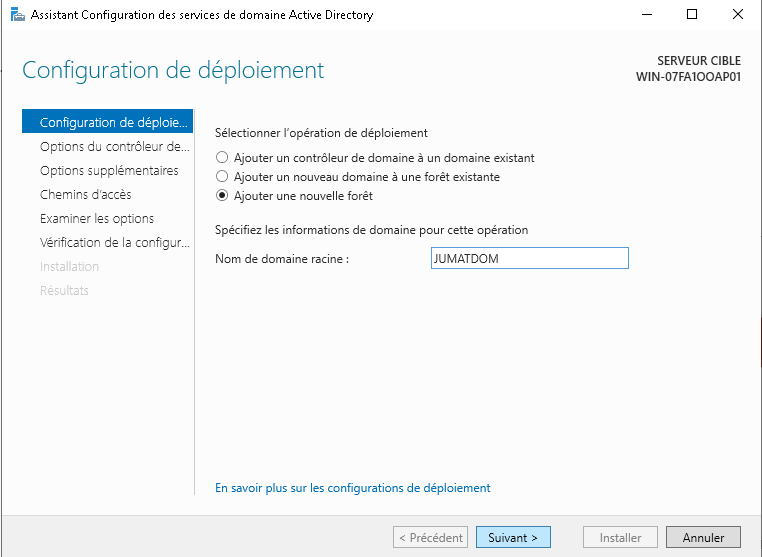

Choisir la version et un mdp pour le gestionnaire de domaine.


Ne rien toucher dans les options DNS, le message d'erreur est apapru car il detecte le DNS de l'iut.

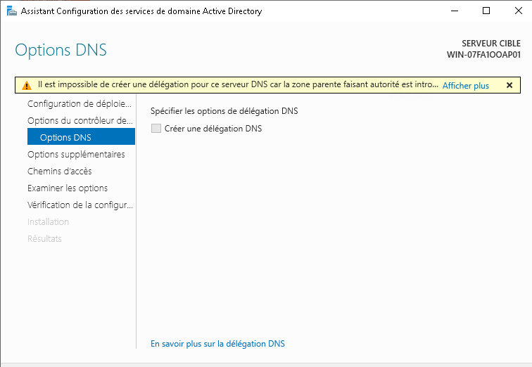

LE nom de domaine NetBios definis à partir de notre nom de domaine, il peut être changer.


Les différrent chemin d'accès je les laisse par défault.

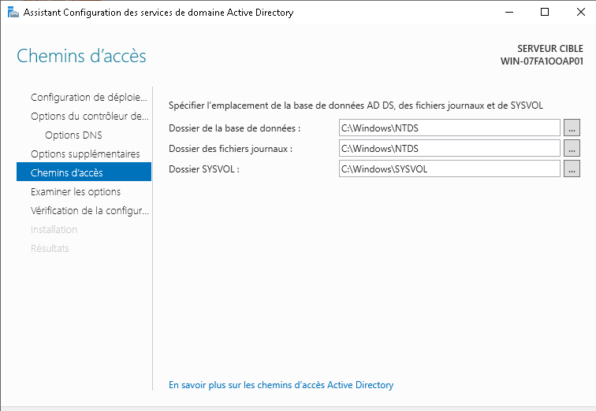

Finir l'installation et lancer le gestionnaire DNS pour finr la configuration.
Une fenêtre récapitulative souvrira, cliquer sur suivant et terminer.
Maintenant il faut mettre dans le deuxieme serveur uniquement l'ip du DNS de ce serveur de domaine et s'assurer qu'ils sont sur le même domaine.

Dans le pare feu activer la regles iSCSI dans les deux sens (entrer et sortie) pour permettre ici la migration de stockage des VM entre serveurs.

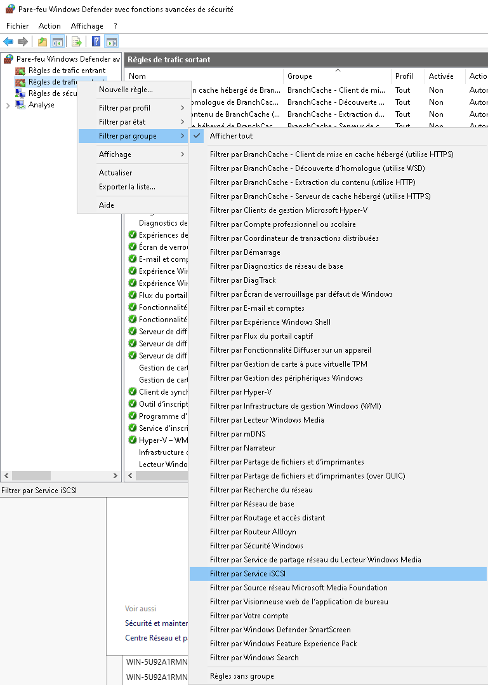

</br></br></br>

### Connection des serveurs

Création du cluster de serveur.
Ajout des deux serveurs au cluster à l'aide du `Gestionnaire de cluster` afin qu'ils soit connecter ensemble. Pour permettre une meilleur fonctionnement des applications.

Selection des serveurs qui vont êtres ajouter au cluster.


Je décide de ne pas executer le test car je vais le faire après l'installation.


Selection du nom du cluster.


Confirmation des décisions.


Voilà le cluster est crée et opérationnel mais toute les fonctionnalaité apporté par le cluster ne sont pas active.

Maintenant relié les deux serveur hyper-v entre eux.

Pour ce faire lancer le Gestionnaire Hyper-v. Ensuite dans la liste à guauche cliquer droit sur gestionnaire Hyper-v et selectionner `Se connecter au serveur`, mettre dans autre ordinateur le nom du serveur que l'ont souhaite ajouter (ex:`WIN-XXXXXXXX`).

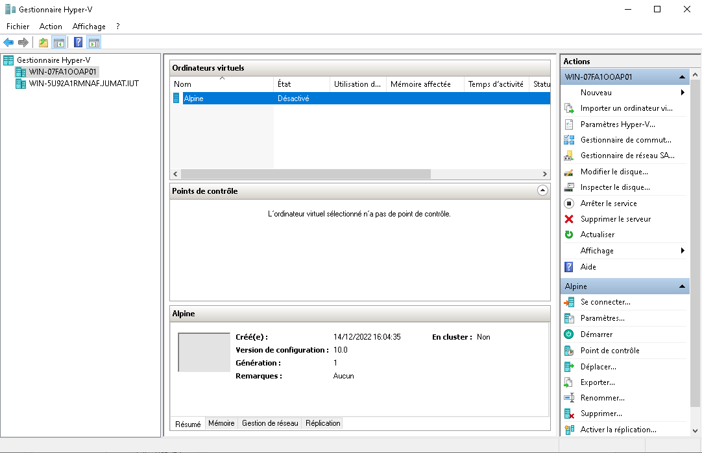

Voilà à quoi devrai ressembler les deux serveurs connecter.
Activer la migration dynamique sur les deux serveur :


Je crée une VM pour essayer la migration dynamique. J'utilise une Alpine.

Création VM rapide :


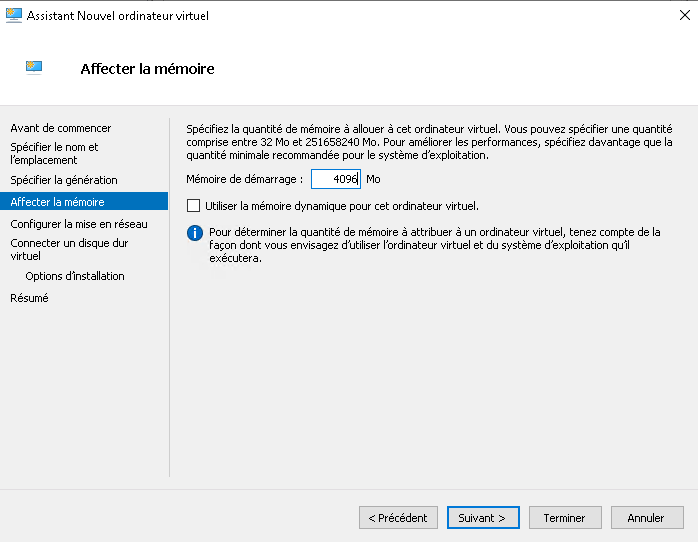


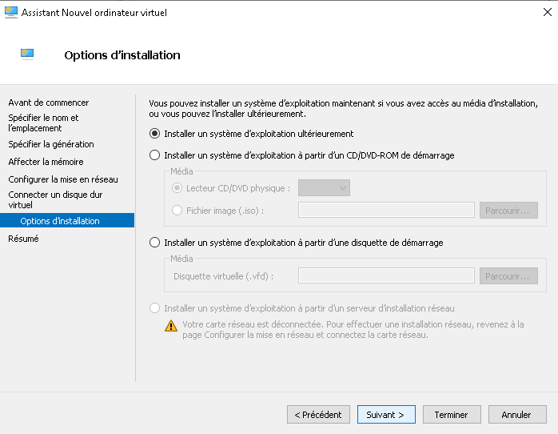

Après ça je la démarre et commence la migration à chaud DE PLUS le lecteur virtuel ISO est toujours attaché ce qui n'est pas possible avec la concurrence :


Cliquer droit sur la VM -> Déplacer


Passer la première fenêtre


Selectionner déplacer l'ordinateur virtuel pour pouvoir déplacer l'integralité de la VM.


Je selectionne le serveur vers lequel migrer ma VM.

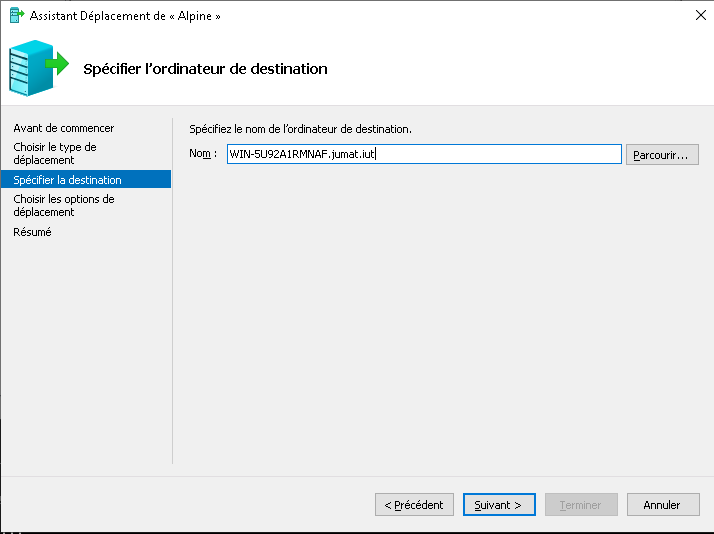

Je choisis de tout migrer.


Dossier de destination de la VM sur l'autre serveur.


Commencement de la migration.


Dans le statut de la VM ont peu voir l'avancement du transfert.


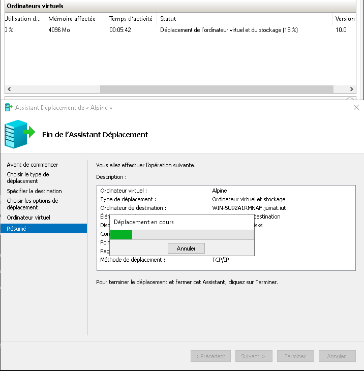

Arriver de la VM sur le serveur de destination sans problèmes.


Comme vu la VM a migrer à chaud du serveur WIN-07... vers le WIN-5U... Et ce sans coupure durant le transfert. Mais il y à juste eu une 'actualisation' de la fenêtre de la VM mais je ne pense pas que ce genre de chose soit visible sur un ssh ou bureau distant.

La migration à froid fonctionne aussi et dans la même configuration des choses.

Voici toute les technique tenter qui n'ont pas aboutis a un résultat positif :

1: Création d'un disque virtuel iSCSI pour les VM :

J'ai voulut crée un disque iSCSI pour pouvoir mettre le stockage des vm sur un disque partagé virtuel, mais j'ai eu différent problèmes que j'ai eu du mal à règler.

2: Création d'une pool de stockage dédier :

J'ai essayer de crée une pool de stockage spécial pour les VM mais malheuresement les disque virtuel crée dans le bios de 500Go n'ont pas été reconnu par le cluster donc impossible d'aller plus loins.

3: Création d'un cluster complet pour faciliter la gestion d'Hyper-V:

Comme dit précedement la partie stockage du cluster à été trés difficile voir impossible à faire, de plus les serveur étant sur un réseau non-professionel le cluster n'acceptait pas la configuration. Il etait possible de faire un test complet ou précis de sont cluster en voila une image du rapport de sortie avec des erreurs :


</br></br></br>

## VPN Wireguard VPN pour administration a distance

Ici la salle est sur le resau 10.202.0.0/16 et le VPN sur le 172.20.0.0/16.
Le resau de l'iut et nater et il est imposible de faire du port-forwarding, il est donc imposible de metre directement notre serveur VPN sur le resau de l'iut.
Pour regler ce probleme nous allont metre le serveur VPN sur un VPS et le serveur ProxMox de l'iut sera un client qui auras un keepalive qui conserveras le tunelle vpn. Grace a cette architecture et la mise en place de routage et de regle de NAT des packet ont peut acceder a la salle cloud depuis le serveur proxmox avec sont IP.

Voici un schéma de notre installation.


### Configuration du serveur VPS par commande

Voici comment on peut configurer wireguard en ligne de commande. Ici ce sont les commande de configuration du serveur VPS.

```bash
wg genkey > priv 
```

Ici on génère la clé privée de notre client (dans ce cas celle du serveur).

```bash
sudo ip link add wg0 type wireguard 
```

Ici on crée notre nouvelle interface de réseau de type wireguard.

```bash
sudo ip a add 172.20.20.1/16 dev wg0 
```

Ici, on lui donne l'adresse IP que l'on souhaite. Dans ce cas, on utilise une adresse IP privée dans un réseau en 172.20.0.0/16 pour éviter tout conflit avec la salle cloud ou avec les réseaux locaux des clients.

```bash
wg set wg0 private-key ./privatekey 
```

Ici on attribue la clé que l'on a générée précédemment.

```bash
sudo ip link set wg0 up 
```

Ici, on active l'interface que nous avons créée.

```bash
sudo wg set wg0 peer xxxxxxxxxxxxxxxxxxxxxxxxxxxxxxxxxxxxxxxxxxxx allowed-ips 172.20.20.2/32 
```

Après avoir suivi la procédure précédente pour les clients, on peut les ajouter en utilisant cette commande. Nous spécifions leur clé publique et leur adresse IP à laquelle nous autorisons l'accès. Ici, nous autorisons une adresse IP en /32 pour garantir qu'uniquement cette adresse IP puisse se connecter.

```bash
sudo wg set wg0 peer xxxxxxxxxxxxxxxxxxxxxxxxxxxxxxxxxxxxxxxxxxxx allowed-ips 172.20.20.3/32,10.202.0.0/16 
```

De même ici, mais en ajoutant les adresses IP de la salle afin de pouvoir communiquer avec.

```bash
echo 1 > /proc/sys/net/ipv4/ip_forward 

```

Ici, on active le routage de paquets pour que les pairs puissent envoyer des paquets au réseau 10.202.0.0/16.

```bash
ip route add 10.202.0.0/16 via 172.20.20.3 
```

On ajoute donc la route pour le résau.

#### Côté client

Du coté client on doit reprendre aproximativement les configurations du VPS sauf que l'on doit set le vps en tant que peer.

```bash
sudo wg set wg0 peer xxxxxxxxxxxxxxxxxxxxxxxxxxxxxxxxxxxxxxxxxxxx allowed-ips 172.20.0.0/16,10.202.0.0/16 endpoint XX.XX.XX.XX:XX #Ici, on met toujours la clé publique et les IP autorisées, mais on rajoute également l'IP publique du serveur VPN.
```

### Sauvegarder les configurations que l'on a fait

Les configuration que l'on a fait en commande sont volatile, il faut donc les sauvegardes dans un fichier de configuraion pour les conserver.

```bash
wg showconf wg0 > /etc/wireguard/wg0.conf 
```

Ici, on affiche les configurations puis on les redirige vers un fichier de configuration.

```bash
systemctl enable --now wg-quick@wg0 
```

Ici, pour le VPS et le serveur de l'IUT, on active l'option qui permet à l'interface de se réactiver automatiquement lors du redémarrage.

### Configuration du VPS

Voici le fichier de configuration du VPS. Que l'on quelque peut modifier afin que l'on ait plus a taper de comande apres l'activation de l'interface. De plus avec les fichier de donfiguration, lors de l'activation de l'interface les routes sont ajouter automatiquement.

```bash
[Interface]
ListenPort = 52403 #Ici, on fixe le port pour qu'il ne change pas à chaque redémarrage.
Address = 172.20.20.1/16 #Adresse du VPS dans notre VPN
PrivateKey = xxxxxxxxxxxxxxxxxxxxxxxxxxxxxxxxxxxxxxxxxxxx #Clé privée générée plutôt.
PostUp=echo 1 > /proc/sys/net/ipv4/ip_forward #Activation au démarrage du routage des paquets

[Peer]
PublicKey = xxxxxxxxxxxxxxxxxxxxxxxxxxxxxxxxxxxxxxxxxxxx #Clé publique du peer
AllowedIPs = 172.20.20.2/32 #IP autorisée
Endpoint = 193.57.121.159:65526 #IP de l'endpoint (Généré automatiquement, si le peer se connecte depuis une autre IP, cela ne pose pas de problème)

[Peer]
PublicKey = xxxxxxxxxxxxxxxxxxxxxxxxxxxxxxxxxxxxxxxxxxxx
AllowedIPs = 172.20.20.3/32, 10.202.0.0/16
Endpoint = 194.199.227.10:35924
```

</br></br></br>

### Configuration du serveur IUT

Voici le fichier de configuration du serveur Proxmox coté iut. (Client VPS)

```bash
[Interface]
ListenPort = 35924
PrivateKey = xxxxxxxxxxxxxxxxxxxxxxxxxxxxxxxxxxxxxxxxxxxx
Address = 172.20.20.3/16
PostUp=echo 1 > /proc/sys/net/ipv4/ip_forward && iptables -t nat -A POSTROUTING -s 172.20.0.0/16 -o vmbr0 -j MASQUERADE #Ici, on autorise le routage de paquets et on ajoute une règle iptables pour NATer les paquets sur le réseau.
PostDown=iptables -t nat -D POSTROUTING -s 172.20.0.0/16 -o vmbr0 -j MASQUERADE #Ici on désactive le NAT.

[Peer]
PublicKey = xxxxxxxxxxxxxxxxxxxxxxxxxxxxxxxxxxxxxxxxxxxx
AllowedIPs = 172.20.0.0/16
Endpoint = XX.XX.XX.XX:XX #ip:port
PersistentKeepalive = 25 #Ici on met un keepalive de 25 secondes qui permet de maintenir le tunnel VPN en fonctionnement.
```

### Configuration du poste Client

Voici le fichier de configuration du poste client.

```bash
[Interface]
ListenPort = 58432
PrivateKey = xxxxxxxxxxxxxxxxxxxxxxxxxxxxxxxxxxxxxxxxxxxx
Address = 172.20.20.2/16

[Peer]
PublicKey = xxxxxxxxxxxxxxxxxxxxxxxxxxxxxxxxxxxxxxxxxxxx
AllowedIPs = 172.20.0.0/16, 10.202.0.0/16
Endpoint = XX.XX.XX.XX:XX #ip:port
```

</br></br></br>

### Activation

Pour activer l'interface au demarage :

```bash
sudo systemctl enable --now wg-quick@wg0
```

Pour l'activer ponctuellement :


### Setup IP et ping

Ici mon interface resau wlp1s0 est connecter a un partage de connection en 4G. Avec l'interface wg0 d'activer et de connerter je peux bien ping le resaux de l'IUT.


### TraceRoute

Depuis cette foi-ci le resau fibre de mon appartement je realise un trace route, je passe bien par mon VPS puis le serveur de l'IUT pour ensuite arriver sur la salle.


### Desactivation

Pour desactiver l'interface :


## Comparatif et conclusion

> Dans cette partie on vas raliser un comparatif des trois solution de virtualisation avec plusieur critaire, et nous rendront notre avis sur quel systeme nous semble le plus adequoit en remplacement de VMWare.

### Performances

En terme de perfomance pure les diferent systeme ont des performance asser similiaire, que ce soir sur de la virtualisation de machine linux ou windows les diferences de performance entre les diferent systemes sont asser negligable en tent que critaire de selection. Même si aprês plusieur comparaisont et sur de plus grande echelle on peut constater de meilleur performance pour windows serveur.

### Flexibilité et facilité d'utilisation

Pour la flexibilité et facilité d'utilisation, les trois solutions diffères, commençons avec windows qui lui est trés compliqué à configurer, l'installation est simple mais pour la mise en places des rôles et fonctionnalités, il vas falloir beaucoup de connaissance sur les environnnment windows et de temps. Proxmox et vmware sont eux beaucoup plus simple à mettre en place notament grâce à une communauté bien plus grande que windows. Une fois ces étapes faite le menu utilisateur et administrateur sont plutot ressemblant entre proxmox et vmware. Windows lui reste plus complexe si on utilise pas `Admin Center`.

### Coûts

En ce qui concerne les coûts, les deux systèmes sont assez différents : Proxmox est gratuit en théorie mais en production, il est absolument nécessaire d'avoir un support qui est donc payant.

En ce qui concerne Windows Server, il fonctionne sous forme de licence (5 ans de durée de vie) et nécessite plusieurs licences différentes : une pour le serveur maître et d'autres pour les serveurs esclaves. Les licences en question ont une durée de vie de 5 ans.

Comparer les prix est assez difficile vu les différences de fonctionnement de chaque système, mais pour résumer, Windows Server sera plus rentable sur une infrastructure plus grande.

Par exemple, si on prend 11 serveurs (1 maître, 10 esclaves) sur 5 ans, on aura :

Pour Windows, ce sera une licence Datacenter à 6200 $ et dix licences Standard à 1070 $, ce qui reviendra à environ 17 000 $ pour les 5 ans complets.

Tandis que pour Proxmox, l'assistance coûte environ 950 $ (890 €) par an par CPU, donc dans ce cas, sur 5 ans, cela reviendra à environ 52 250 $.

En contrepartie, si on utilise une infrastructure plus petite, il sera plus rentable d'utiliser Proxmox.

### La sécurité

Windows Server dispose de fonctionnalités de sécurité intégrées, telles que le pare-feu Windows, le contrôle des comptes d'utilisateur et BitLocker, qui peuvent aider à protéger contre les logiciels malveillants et l'accès non autorisé.

Proxmox, d'autre part, offre un niveau élevé de sécurité grâce à son noyau Linux et son environnement Debian, qui permettent l'utilisation de nombreux outils de sécurisation.

La sécurité des serveurs dépendra vraiment de la configuration effectuée sur ces derniers.

### La compatibilité matérielle

La compatibilité materielle de proxmox(Linux), Hyper-V(Windows) et WmWare('Linux') sont quasiment identique, il sont trés flexible sur le matérielle utilisé. Les seul limitations sont pour les cluster de windows par exemple, les serveurs doivent se ressembler, voir avoir la même architecture sinon des incompatibilé peuvent avoit lieu. Par exemple lors d'une migration dynamique d'une VM. Sinon les trois solutions sont compatible avec quasiment tout, même un vieux pc portable duo core et 2G de ram installé dans sont salon.

### Les fonctionnalités

En termes de fonctionnalités, Windows Server réussit à se démarquer grâce à sa polyvalence. Il permet l'accès à de nombreuses fonctionnalités utiles pour les entreprises, comme les annuaires. En ce qui concerne la virtualisation, Windows profite de ses fonctionnalités propriétaires tandis que Proxmox utilise des fonctionnalités open source comme CEPH, ce qui permet d'avoir accès à un large éventail de fonctionnalités.

</br></br></br></br>

--------

## Conclusion

En conclusion, bien que Windows Server Hyper-V présente certaines différences de performances, de coûts, de performance et de polyvalence par rapport à Proxmox, le choix entre ces deux systèmes de virtualisation dépend principalement de votre connaissance de l'environnement. Si vous souhaitez remplacer VMWare, Proxmox pourrait être plus facile à maîtriser, étant basé sur Linux, un système d'exploitation que vous connaissez particulièrement bien. Cependant, si vous êtes un grand utilisateur de Windows, il pourrait être plus intéressant de passer par Windows Server Hyper-V. Dans notre cas, nous pencherons plutôt vers Proxmox étant donné que nous sommes familiarisés avec Linux.
