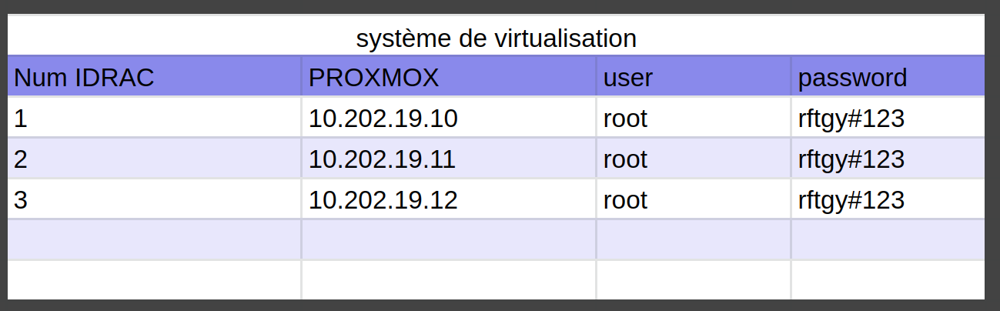

## Compte rendu SAE3D04

</br></br>

### Mettre en place une infrastructure virtualisée

> Ce projet vise à comparer différents systèmes de virtualisation pour remplacer l'environnement VMWare actuellement en place. L'expertise a été réalisée dans un contexte professionnel et a impliqué l'installation et la configuration de serveurs Windows et Proxmox. Les progrès de l'installation ont été documentés pour créer une documentation utile et explicative de nos actions. Le compte rendu général reprend les comptes rendus de chaque partie.

</br></br>

### Table des matières

1. Gestion de projet
2. Proxmox
3. Hyper-V et Windows Server
4. VPN
5. Comparatif et conclusion

</br></br></br></br></br>

### Gestion de projet

#### Le projet

Le projet est basé sur une situation professionnelle, qui consiste en une expertise ayant pour but de comparer différents systèmes de virtualisation afin de remplacer l'environnement VMWare.

##### Nos objectifs

Pour réaliser ce projet, notre objectif est de comparer VMware, Hyper-V (la solution de virtualisation de Windows) et Proxmox (une solution de virtualisation open source gratuite).

Pour ce faire, nous avons décidé d'installer ces deux solutions directement sur des serveurs physiques. Nous nous fixons donc comme objectif d'installer deux serveurs Hyper-V et trois serveurs Proxmox afin de faire fonctionner CEPH.

Pour résumer :

* 2 serveurs Windows qui communiquent entre eux pour réaliser des migrations à chaud
* 3 serveurs Proxmox avec un système de partage de fichiers CEPH pour effectuer les migrations à chaud.

##### Notre organisation

Nous avons d'abord noté dans un référentiel git le sujet qui est accessible à tous afin que tous les membres du groupe comprennent bien nos objectifs.


Après cela, pour simplifier la gestion des tâches et avoir une organisation claire du travail à exécuter, nous avons pris l'initiative de réaliser un projet "SAE Cloud" sur Jira Work Management afin de visualiser les tâches de chacun et de suivre l'avancement du projet.


En plus pour une meilleure gestion des serveurs, nous avons mis en place des crédits en ligne accessibles par tous et modifiables selon nos configurations.





Parmi les informations utiles incluses dans ces crédits, nous avons :


##### Taches realiser au cours du projet

Lors de ce projet, nous avons réalisé plusieurs tâches réparties sur deux semaines. Elles sont résumées dans le schéma suivant :


Pour résumer, nous avons pu réaliser toutes les installations que nous voulions faire sur Proxmox. Nous avons également pu installer un VPN qui nous a permis d'administrer nos serveurs à distance. Du côté de Windows, nous avons pu découvrir l'environnement Windows Server et Hyper-V, et nous somme allez jusqu'a la migration a chaud.

##### Conclusion et ameloiration possible

On peut donc dire que malgré l'ampleur de notre projet, grâce au travail fourni par les membres du groupe, nous avons atteint nos objectifs principaux.

Ce projet nous a montré que la coordination du travail est très importante, car nous avons pu voir qu'un manque de coordination pouvait mener à des désaccords au sein d'un groupe de travail. En vue d'améliorer notre travail en groupe à l'avenir, nous pourrions mettre en place des méthodes de gestion de projet plus efficaces pour éviter ces désaccords et atteindre nos objectifs de manière plus efficace.

### Proxmox

### Hyper-V et Windows Server

### VPN Wireguard VPN pour administration a distance

Ici la salle est sur le resau 10.202.0.0/16 et le VPN sur le 172.20.0.0/16.
Le resau de l'iut et nater et il est imposible de faire du port-forwarding, il est donc imposible de metre directement notre serveur VPN sur le resau de l'iut.
Pour regler ce probleme nous allont metre le serveur VPN sur un VPS et le serveur ProxMox de l'iut sera un client qui auras un keepalive qui conserveras le tunelle vpn. Grace a cette architecture et la mise en place de routage et de regle de NAT des packet ont peut acceder a la salle cloud depuis le serveur proxmox avec sont IP.

Voici un schéma de notre installation.


#### Configuration du serveur VPS par commande

Voici comment on peut configurer wireguard en ligne de commande. Ici ce sont les commande de configuration du serveur VPS.

```bash
wg genkey > priv 
```

Ici on génère la clé privée de notre client (dans ce cas celle du serveur).

```bash
sudo ip link add wg0 type wireguard 
```

Ici on crée notre nouvelle interface de réseau de type wireguard.

```bash
sudo ip a add 172.20.20.1/16 dev wg0 
```

Ici, on lui donne l'adresse IP que l'on souhaite. Dans ce cas, on utilise une adresse IP privée dans un réseau en 172.20.0.0/16 pour éviter tout conflit avec la salle cloud ou avec les réseaux locaux des clients.

```bash
wg set wg0 private-key ./privatekey 
```

Ici on attribue la clé que l'on a générée précédemment.

```bash
sudo ip link set wg0 up 
```

Ici, on active l'interface que nous avons créée.

```bash
sudo wg set wg0 peer xxxxxxxxxxxxxxxxxxxxxxxxxxxxxxxxxxxxxxxxxxxx allowed-ips 172.20.20.2/32 
```

Après avoir suivi la procédure précédente pour les clients, on peut les ajouter en utilisant cette commande. Nous spécifions leur clé publique et leur adresse IP à laquelle nous autorisons l'accès. Ici, nous autorisons une adresse IP en /32 pour garantir qu'uniquement cette adresse IP puisse se connecter.

```bash
sudo wg set wg0 peer xxxxxxxxxxxxxxxxxxxxxxxxxxxxxxxxxxxxxxxxxxxx allowed-ips 172.20.20.3/32,10.202.0.0/16 
```

De même ici, mais en ajoutant les adresses IP de la salle afin de pouvoir communiquer avec.

```bash
echo 1 > /proc/sys/net/ipv4/ip_forward 

```

Ici, on active le routage de paquets pour que les pairs puissent envoyer des paquets au réseau 10.202.0.0/16.

```bash
ip route add 10.202.0.0/16 via 172.20.20.3 
```

On ajoute donc la route pour le résau.

##### Côté client

Du coté client on doit reprendre aproximativement les configurations du VPS sauf que l'on doit set le vps en tant que peer.

```bash
sudo wg set wg0 peer xxxxxxxxxxxxxxxxxxxxxxxxxxxxxxxxxxxxxxxxxxxx allowed-ips 172.20.0.0/16,10.202.0.0/16 endpoint XX.XX.XX.XX:XX #Ici, on met toujours la clé publique et les IP autorisées, mais on rajoute également l'IP publique du serveur VPN.
```

#### Sauvegarder les configurations que l'on a fait

Les configuration que l'on a fait en commande sont volatile, il faut donc les sauvegardes dans un fichier de configuraion pour les conserver.

```bash
wg showconf wg0 > /etc/wireguard/wg0.conf 
```

Ici, on affiche les configurations puis on les redirige vers un fichier de configuration.

```bash
systemctl enable --now wg-quick@wg0 
```

Ici, pour le VPS et le serveur de l'IUT, on active l'option qui permet à l'interface de se réactiver automatiquement lors du redémarrage.

#### Configuration du VPS

Voici le fichier de configuration du VPS. Que l'on quelque peut modifier afin que l'on ait plus a taper de comande apres l'activation de l'interface. De plus avec les fichier de donfiguration, lors de l'activation de l'interface les routes sont ajouter automatiquement.

```bash
[Interface]
ListenPort = 52403 #Ici, on fixe le port pour qu'il ne change pas à chaque redémarrage.
Address = 172.20.20.1/16 #Adresse du VPS dans notre VPN
PrivateKey = xxxxxxxxxxxxxxxxxxxxxxxxxxxxxxxxxxxxxxxxxxxx #Clé privée générée plutôt.
PostUp=echo 1 > /proc/sys/net/ipv4/ip_forward #Activation au démarrage du routage des paquets

[Peer]
PublicKey = xxxxxxxxxxxxxxxxxxxxxxxxxxxxxxxxxxxxxxxxxxxx #Clé publique du peer
AllowedIPs = 172.20.20.2/32 #IP autorisée
Endpoint = 193.57.121.159:65526 #IP de l'endpoint (Généré automatiquement, si le peer se connecte depuis une autre IP, cela ne pose pas de problème)

[Peer]
PublicKey = xxxxxxxxxxxxxxxxxxxxxxxxxxxxxxxxxxxxxxxxxxxx
AllowedIPs = 172.20.20.3/32, 10.202.0.0/16
Endpoint = 194.199.227.10:35924
```

#### Configuration du serveur IUT

Voici le fichier de configuration du serveur Proxmox coté iut. (Client VPS)

```bash
[Interface]
ListenPort = 35924
PrivateKey = xxxxxxxxxxxxxxxxxxxxxxxxxxxxxxxxxxxxxxxxxxxx
Address = 172.20.20.3/16
PostUp=echo 1 > /proc/sys/net/ipv4/ip_forward && iptables -t nat -A POSTROUTING -s 172.20.0.0/16 -o vmbr0 -j MASQUERADE #Ici, on autorise le routage de paquets et on ajoute une règle iptables pour NATer les paquets sur le réseau.
PostDown=iptables -t nat -D POSTROUTING -s 172.20.0.0/16 -o vmbr0 -j MASQUERADE #Ici on désactive le NAT.

[Peer]
PublicKey = xxxxxxxxxxxxxxxxxxxxxxxxxxxxxxxxxxxxxxxxxxxx
AllowedIPs = 172.20.0.0/16
Endpoint = XX.XX.XX.XX:XX #ip:port
PersistentKeepalive = 25 #Ici on met un keepalive de 25 secondes qui permet de maintenir le tunnel VPN en fonctionnement.
```

#### Configuration du poste Client

Voici le fichier de configuration du poste client.

```bash
[Interface]
ListenPort = 58432
PrivateKey = xxxxxxxxxxxxxxxxxxxxxxxxxxxxxxxxxxxxxxxxxxxx
Address = 172.20.20.2/16

[Peer]
PublicKey = xxxxxxxxxxxxxxxxxxxxxxxxxxxxxxxxxxxxxxxxxxxx
AllowedIPs = 172.20.0.0/16, 10.202.0.0/16
Endpoint = XX.XX.XX.XX:XX #ip:port
```

#### Activation

Pour activer l'interface au demarage :

```bash
sudo systemctl enable --now wg-quick@wg0
```

Pour l'activer ponctuellement :


#### Setup IP et ping

Ici mon interface resau wlp1s0 est connecter a un partage de connection en 4G. Avec l'interface wg0 d'activer et de connerter je peux bien ping le resaux de l'IUT.


#### TraceRoute

Depuis cette foi-ci le resau fibre de mon appartement je realise un trace route, je passe bien par mon VPS puis le serveur de l'IUT pour ensuite arriver sur la salle.


#### Desactivation

Pour desactiver l'interface :


### Comparatif et conclusion

Performances : il est important de comparer les performances des deux systèmes en termes de temps d'exécution des tâches et de consommation des ressources (mémoire, processeur, etc.).

Flexibilité et facilité d'utilisation : il est important de comparer la facilité d'utilisation des deux systèmes, notamment en ce qui concerne la création et la gestion des machines virtuelles. La compatibilité avec différents systèmes d'exploitation et applications est également un aspect à prendre en compte.

Coûts : il est important de comparer les coûts associés à chaque système de virtualisation, notamment en termes de licences et de support technique.

La sécurité : il est important de comparer les niveaux de sécurité des deux systèmes, notamment en termes de protection des données et de contrôle d'accès aux machines virtuelles.

La compatibilité matérielle : il est important de vérifier que les deux systèmes de virtualisation sont compatibles avec les différents composants matériels de votre ordinateur (carte graphique, disques durs, etc.).

Les fonctionnalités avancées : il est utile de comparer les fonctionnalités avancées proposées par les deux systèmes, telles que la prise en charge de plusieurs systèmes d'exploitation en simultané, la gestion de la mémoire et du processeur en temps réel, etc.
