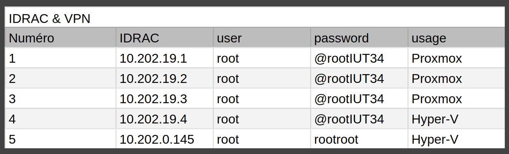
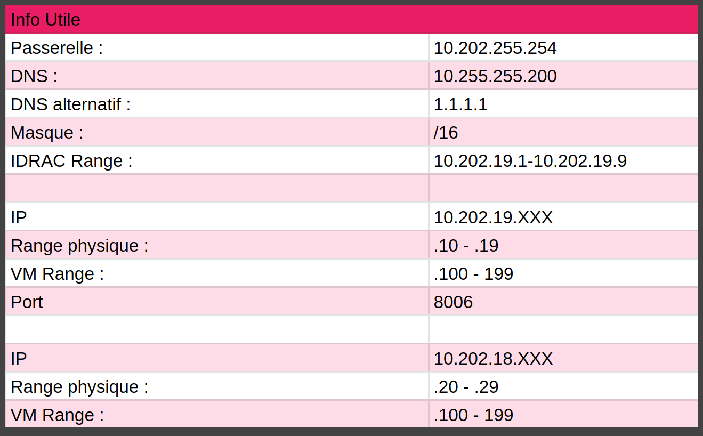
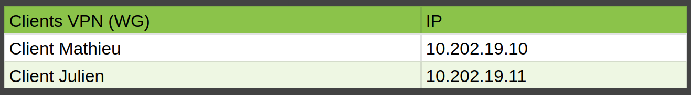

# Gestion de prejet

## Le projet

Le projet est basé sur une situation professionnelle, qui consiste en une expertise ayant pour but de comparer différents systèmes de virtualisation afin de remplacer l'environnement VMWare.

## Nos objectifs

Pour réaliser ce projet, notre objectif est de comparer VMware, Hyper-V (la solution de virtualisation de Windows) et Proxmox (une solution de virtualisation open source gratuite).

Pour ce faire, nous avons décidé d'installer ces deux solutions directement sur des serveurs physiques. Nous nous fixons donc comme objectif d'installer deux serveurs Hyper-V et trois serveurs Proxmox afin de faire fonctionner CEPH.

Pour résumer :

* 2 serveurs Windows qui communiquent entre eux pour réaliser des migrations à chaud
* 3 serveurs Proxmox avec un système de partage de fichiers CEPH pour effectuer les migrations à chaud.

## Notre organisation

Nous avons d'abord noté dans un référentiel git le sujet qui est accessible à tous afin que tous les membres du groupe comprennent bien nos objectifs.

Après cela, pour simplifier la gestion des tâches et avoir une organisation claire du travail à exécuter, nous avons pris l'initiative de réaliser un projet "SAE Cloud" sur Jira Work Management afin de visualiser les tâches de chacun et de suivre l'avancement du projet.

En plus pour une meilleure gestion des serveurs, nous avons mis en place des crédits en ligne accessibles par tous et modifiables selon nos configurations.

Parmi les informations utiles incluses dans ces crédits, nous avons :

## Taches realiser au cours du projet

Lors de ce projet, nous avons réalisé plusieurs tâches réparties sur deux semaines. Elles sont résumées dans le schéma suivant :

Pour résumer, nous avons pu réaliser toutes les installations que nous voulions faire sur Proxmox. Nous avons également pu installer un VPN qui nous a permis d'administrer nos serveurs à distance. Du côté de Windows, nous avons pu découvrir l'environnement Windows Server et Hyper-V, même si, faute de temps et de connaissance de ce milieu, nous n'avons pas pu réaliser tous nos objectifs, notamment la migration a chaud.

## Conclusion et ameloiration possible

On peut donc dire que malgré l'ampleur de notre projet, grâce au travail fourni par les membres du groupe, nous avons atteint nos objectifs principaux.

Ce projet nous a montré que la coordination du travail est très importante, car nous avons pu voir qu'un manque de coordination pouvait mener à des désaccords au sein d'un groupe de travail. En vue d'améliorer notre travail en groupe à l'avenir, nous pourrions mettre en place des méthodes de gestion de projet plus efficaces pour éviter ces désaccords et atteindre nos objectifs de manière plus efficace.
