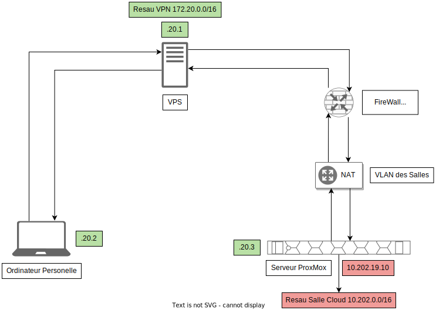

# Wireguard VPN pour administration a distance

Ici la salle est sur le resau 10.202.0.0/16 et le VPS sur le 172.20.0.0/16.
Le resau de l'iut et nater et il est imposible de faire du port-forwarding, il est donc imposible de metre directement notre serveur VPS sur le resaux de l'iut.
Pour regler ce probleme nous allont metre le serveur sur un VPS et le serveur ProxMox de l'iut sera un client qui auras un keepalive qui conserveras le tunelle vpn. Grace a cette architecture et la mise en place de routage et de regle de NAT des packet ont peut acceder a la salle cloud depuis le serveur proxmox avec sont IP.

Voici un resumer visuelle :



## Configuration du serveur VPS par commande

Voici comment on peut configurer wireguard en ligne de commande. Ici ce sont les commande de configuration du serveur VPS.

```bash
wg genkey > priv
sudo ip link add wg0 type wireguard
sudo ip a add 172.20.20.1/16 dev wg0
wg set wg0 private-key ./privatekey
sudo ip link set wg0 up
sudo wg set wg0 peer xxxxxxxxxxxxxxxxxxxxxxxxxxxxxxxxxxxxxxxxxxxx allowed-ips 172.20.20.2/32
sudo wg set wg0 peer xxxxxxxxxxxxxxxxxxxxxxxxxxxxxxxxxxxxxxxxxxxx allowed-ips 172.20.20.3/32,10.202.0.0/16
echo 1 > /proc/sys/net/ipv4/ip_forward
ip route add 10.202.0.0/16 via 172.20.20.3
```

### Côté client

Du coté client on doit reprendre aproximativement les configurations du VPS sauf que l'on doit set le vps en tant que peer.

```bash
sudo wg set wg0 peer xxxxxxxxxxxxxxxxxxxxxxxxxxxxxxxxxxxxxxxxxxxx allowed-ips 172.20.0.0/16,10.202.0.0/16 endpoint XX.XX.XX.XX:XX #ip:port
```

## Save la conf pour reboot

Les configuration que l'on a fait en commande sont volatile, il faut donc les sauvegardes dans un fichier de configuraion pour les conserver.

```bash
wg showconf wg0 > /etc/wireguard/wg0.conf #+ modifier pour les ip, etc...
systemctl enable --now wg-quick@wg0
```

## Fichier Conf VPS

Voici le fichier de configuration du VPS. (serveur VPS)

```bash
[Interface]
ListenPort = 52403
Address = 172.20.20.1/16
PrivateKey = xxxxxxxxxxxxxxxxxxxxxxxxxxxxxxxxxxxxxxxxxxxx
PostUp=echo 1 > /proc/sys/net/ipv4/ip_forward

[Peer]
PublicKey = xxxxxxxxxxxxxxxxxxxxxxxxxxxxxxxxxxxxxxxxxxxx
AllowedIPs = 172.20.20.2/32
Endpoint = 193.57.121.159:65526

[Peer]
PublicKey = xxxxxxxxxxxxxxxxxxxxxxxxxxxxxxxxxxxxxxxxxxxx
AllowedIPs = 172.20.20.3/32, 10.202.0.0/16
Endpoint = 194.199.227.10:35924
```

## Ficher de Conf serv IUT

Voici le fichier de configuration du serveur Proxmox coté iut. (Client VPS)

```bash
[Interface]
ListenPort = 35924
PrivateKey = xxxxxxxxxxxxxxxxxxxxxxxxxxxxxxxxxxxxxxxxxxxx
Address = 172.20.20.3/16
PostUp=echo 1 > /proc/sys/net/ipv4/ip_forward && iptables -t nat -A POSTROUTING -s 172.20.0.0/16 -o vmbr0 -j MASQUERADE 
PostDown=iptables -t nat -D POSTROUTING -s 172.20.0.0/16 -o vmbr0 -j MASQUERADE 

[Peer]
PublicKey = xxxxxxxxxxxxxxxxxxxxxxxxxxxxxxxxxxxxxxxxxxxx
AllowedIPs = 172.20.0.0/16
Endpoint = XX.XX.XX.XX:XX #ip:port
PersistentKeepalive = 25
```

## Ficher de Conf Client

Voici le fichier de configuration du poste client. (Client VPS)

```bash
[Interface]
ListenPort = 58432
PrivateKey = xxxxxxxxxxxxxxxxxxxxxxxxxxxxxxxxxxxxxxxxxxxx
Address = 172.20.20.2/16

[Peer]
PublicKey = xxxxxxxxxxxxxxxxxxxxxxxxxxxxxxxxxxxxxxxxxxxx
AllowedIPs = 172.20.0.0/16, 10.202.0.0/16
Endpoint = XX.XX.XX.XX:XX #ip:port
```

## Activation

Pour activer l'interface au demarage :

```bash
sudo systemctl enable --now wg-quick@wg0
```

Pour l'activer ponctuellement :


## Setup IP et ping

Ici mon interface resau wlp1s0 est connecter a un partage de connection en 4G. Avec l'interface wg0 d'activer et de connerter je peux bien ping le resaux de l'IUT.


## TraceRoute

Depuis cette foi-ci le resau fibre de mon appartement je realise un trace route, je passe bien par mon VPS puis le serveur de l'IUT pour ensuite arriver sur la salle.


## Desactivation

Pour desactiver l'interface :


